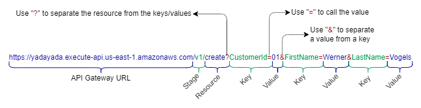

# AWS Serverless CRUD API

A CRUD API is an API that can perform CREATE, READ, UPDATE, and DELETE operations on a database.

This demo is a production-ready serverless deployment, using the following architecture:

## Resources deployed by this manifest:

- Dynamodb table.
- Python lambda function (This is the API).
- Api Gateway
  - v1 Stage
  - Basic usage plan
  - API Key
  - /create (POST) resource and methods
  - /read (GET) resource and methods
  - /update (PUT) resource and methods
  - /delete (Delete) resource and methods
- IAM:
  - Lambda permissions to Create, Read, Update and Delete Items in the project's DynamoDB table.
  - Lambda permissions to send logs to CloudWatch
  - API Gateway permissions to trigger the lambda function

### Deployment diagram:


## Tested with: 

| Environment | Application | Version  |
| ----------------- |-----------|---------|
| WSL2 Ubuntu 20.04 | Terraform | v1.0.10 |
| WSL2 Ubuntu 20.04 | aws-cli | v2.2.12 |
| WSL2 Ubuntu 20.04 | Python | 3.9.5 |

## Initialization How-To:

Located in the root directory, make an "aws configure" to log into the aws account, and a "terraform init" to download the necessary modules and start the backend.

```bash
aws configure
terraform init
```

## Deployment How-To:

Located in the root directory, make the necessary changes in the variables.tf file and run the manifests:

```bash
terraform apply
```

## Debugging / Troubleshooting:

### Test the API:

There are several ways to make an API request, so in the following examples I'm only going to cover how to do it using [CURL](https://en.wikipedia.org/wiki/CURL), just because it's the easiest

The curl request is composed of:
 1. **Command, parameters and method**
    - curl -k -X {Method}
      - curl: Command
      - -k: Ignore certificate
      - -X: Execute
      - Method: POST, GET, PUT or DELETE.
 2. **URL + Payload**
    - Formatting: https://{API Gateway URL}/{Stage}?{Key}={Value}&{Key}={Value}
    - e.g:



 3. **Header with API Key**
    - -H 'x-api-key: {API Key}'
      - -H: Headers
      - x-api-key: API Key Header for Amazon Api Gateway
      - API Key: The API Key Value
        - Note: Execute "terraform output -raw api_key" to get the value.

CREATE:
```bash
curl -k -X https://yadayada.execute-api.us-east-1.amazonaws.com/v1/create?CustomerId=01&FirstName=Werner&LastName=Vogels -H 'x-api-key: 1234abcd'
```

READ:
```bash
curl -k -X https://yadayada.execute-api.us-east-1.amazonaws.com/v1/read?CustomerId=01 -H 'x-api-key: 1234abcd'
```

UPDATE:
```bash
curl -k -X https://yadayada.execute-api.us-east-1.amazonaws.com/v1/update?CustomerId=01&LastName=Werners -H 'x-api-key: 1234abcd'
```

DELETE:
```bash
curl -k -X https://yadayada.execute-api.us-east-1.amazonaws.com/v1/delete?CustomerId=01 -H 'x-api-key: 1234abcd'
```

### Lambda testing events:

In the "lambda_test_events" folder you will find all the test events that I use during this project.

There are ideal to test from VS Code can use them from VS Code:


But you can also copy the content and use it from the aws-cli:

```bash
aws lambda invoke --function-name ServerlessCRUD-API --cli-binary-format raw-in-base64-out --payload '{"http_method": "POST", "CustomerId": "1", "FirstName": "Werner", "LastName": "Vogels"}' response.json
```

Or of course from the AWS console.

## Author:

- [@jmanzur](https://jmanzur.com)

## Documentation:

- [Terraform "API Gateway" Documentation](https://registry.terraform.io/providers/hashicorp/aws/latest/docs/resources/api_gateway_rest_api)